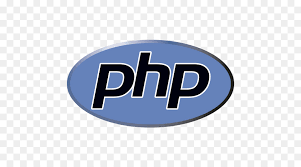
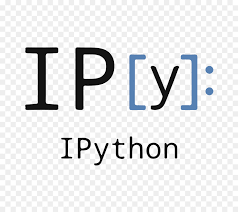
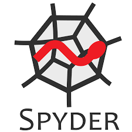

### Hello 👋 World 

**I am a 3rd Year Computer Science Engineering Student. I love Machine Learning and trying to find more about Data Science and Full Stack Web Development.**

   

    
<strong>Languages:</strong>

     <table align="center">
         <tr align="center">
            <td  align = "center"> Python</td>
             <td  align = "center"> C</td>
             <td  align = "center"> Java</td>
             <td  align = "center"> PHP</td>
         </tr>
         <tr align="center">
             <td  align = "center"> JavaScript</td>
             <td  align = "center"> HTML5</td>
             <td  align = "center"> CSS3</td>
             <td  align = "center"> SQL</td>
         </tr>
     </table>
  

   

 

    
<strong>Tools and Technologies:</strong>

     <table align="center">
         <tr align="center">
             <td  align = "center"> OpenCV</td>
             <td  align = "center"> Tensorflow</td>
             <td  align = "center"> Scikit learn</td>
             <td  align = "center"> Keras</td>
             <td  align = "center"> Scipy</td>
             <td  align = "center"> seaborn</td>
             <td  align = "center"> ipython</td>
         </tr>
         <tr align="center">
             <td  align = "center"> Jupyter Notebook</td>
             <td  align = "center"> Git</td>
            <td  align = "center"> GitHub</td>
             <td  align = "center"> pandas</td>
             <td  align = "center"> numpy</td>
             <td  align = "center"> Anaconda</td>
             <td  align = "center"> matplotlib</td>
         </tr>
         <tr align="center">
             <td  align = "center"> React.js</td>
             <td  align = "center"> node js</td> 
             <td  align = "center"> spyder</td>
             <td  align = "center"> pycharm</td>
             <td  align = "center"> intellij</td>
             <td  align = "center"> vscode</td>
             <td  align = "center"> flask</td>  
         </tr>
         <tr align="center">
         </tr>
     </table>
        

        

<strong>Contact</strong>
 

|  |   |   |   |   |   |   
|---|---|---|---|---|---|---|

    
<strong>Repositories You May Like</strong>
 

    

<!-- 🔭 I’m currently working on Machine Learning Based Projects.
- 🌱 I’m currently learning Data Science | Full Stack Web development | Machine Learning.
- 👯 I’m looking to collaborate  on Machine Learning and Web Development Projects.
- 🤔 I’m looking for help in Backend Development.
- 💬 Ask me about Data Science.I will try to help you as much as I can
- ⚡ Quote : You perform the obligatory duties, for action is superior to inaction. And, through inaction, even the maintenance of your body will not be possible.
- 📫 How to reach me: .... 
Reach me -   -->

 **✨ -sarvesh Kumar Sharma**
